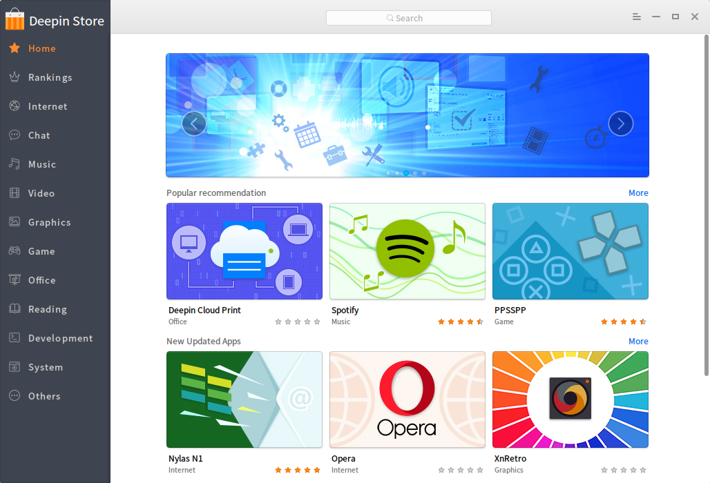

# Deepin Store

**Description**: The Shell powers Deepin Store 4.x.

Deepin Store is a quality app store with rich contents that supports 1-click download and installation. It selected popular recommendations, new applications and topic introduction.

This is a sub-project which is essentially a custom made web browser.

**Tags**: application, utility, admin.

**Screenshot**:



## Dependencies

### Build dependencies

    C++11 support is required. The following tools are needed:

    - CMake >= 3.2
    - pkg-config

    And dev packages:

    - Qt5 >= 5.4
        + Qt5Widgets
        + Qt5DBus
        + Qt5WebKit
        + Qt5X11Extras
        + Qt5Network
    - x11
    - glib-2.0
    - gio-2.0
    - lastore-daemon

### Runtime dependencies

    - Qt5 >= 5.4
        + Qt5Widgets
        + Qt5DBus
        + Qt5WebKit
        + Qt5X11Extras
        + Qt5Network
    - x11
    - glib-2.0
    - gio-2.0
    - lastore-daemon
    - deepin-appstore-data package


## Configuration

The following switches are available. Modify them the `CMakeLists.txt` accordingly.

    - DEBUG_LASTORE: if present, print out debugging information for lastore dbus interfaces
    - DEBUG_LOCAL_REQUEST: if present, print out debugging information for how the program can work offline

Uncomment `find_package(Qt5WebEngineWidgets)` in `CMakeLists.txt` to compile against QtWebEngine (experimental & incomplete).

## Build

This is a typical CMake project. On Debian-based systems, use tools provided by `devscripts` when you have all the dependencies installed.

```
$ dpkg-buildpackage
```

## Installation

Again, typical CMake stuff. On Debain-based systems:

```
# dpkg -i ../????.deb
```

## Getting help

Any usage issues can ask for help via

* [Gitter](https://gitter.im/orgs/linuxdeepin/rooms)
* [IRC channel](https://webchat.freenode.net/?channels=deepin)
* [Forum](https://bbs.deepin.org)
* [WiKi](http://wiki.deepin.org/)

## Getting involved

We encourage you to report issues and contribute changes

* [Contribution guide for users](http://wiki.deepin.org/index.php?title=Contribution_Guidelines_for_Users)
* [Contribution guide for developers](http://wiki.deepin.org/index.php?title=Contribution_Guidelines_for_Developers).


----

## Open source licensing info

Deepin Store is licensed under [GPLv3](LICENSE).
