# Deepin Store|common/deepin-appstore.svg|

## Overview|common/icon_overview.svg|
Deepin Store V4.0 is an application recreated by Deepin Technology Co., Ltd. with the integration of display, download, installation, commenting and rating.

Deepin Store elaborately screens and collects different types of applications for you. Each application has been artificially installed and verified, you can enter the store to search popular applications with one-click download and automatic installation.

 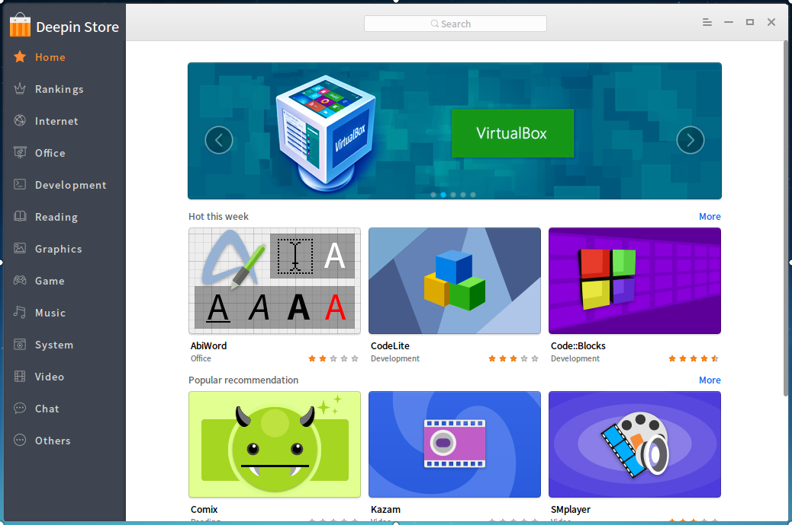

## Basic Operations|common/icon_basicoperation.svg|

### Run Deepin Store

You can run Deepin Store by executing one of the following operations:

- Click on  on dock to enter launcher interface. Then find  to click on by skimming.
- If you have fixed Deepin Store on desktop, double click on .
- If you have fixed Deepin Store on dock, click on .

### Maximize/Minimize Deepin Store

- On Deepin Store interface, click on  to maximize Deepin Store. If you want to restore the normal display, click on .
- On Deepin Store interface, click on   to minimize Deepin Store to Dock. If you want to restore the display, click on  on Dock.

### Close Deepin Store

- On Deepin Store interface, click on  to exit.
- You can right-click on  on Dock to select **Close All** to exit.
- On Deepin Store interface, click on [Exit](#Exit) in the menu bar.

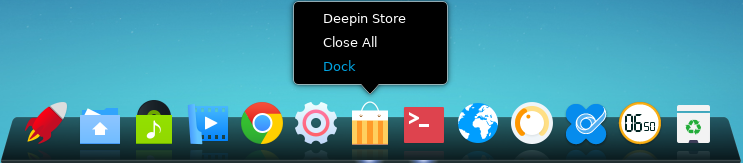

## Main Interface|common/icon_maininterface.svg|

The main interface of Deepin Store consists of navigation bar, search box, flashview, home column, hot topic, task management and menu bar.

> : Navigation bar will be displayed in icons by moving the mouse over its edge and dragging to the left, then hover over icons to display the category name of applications.

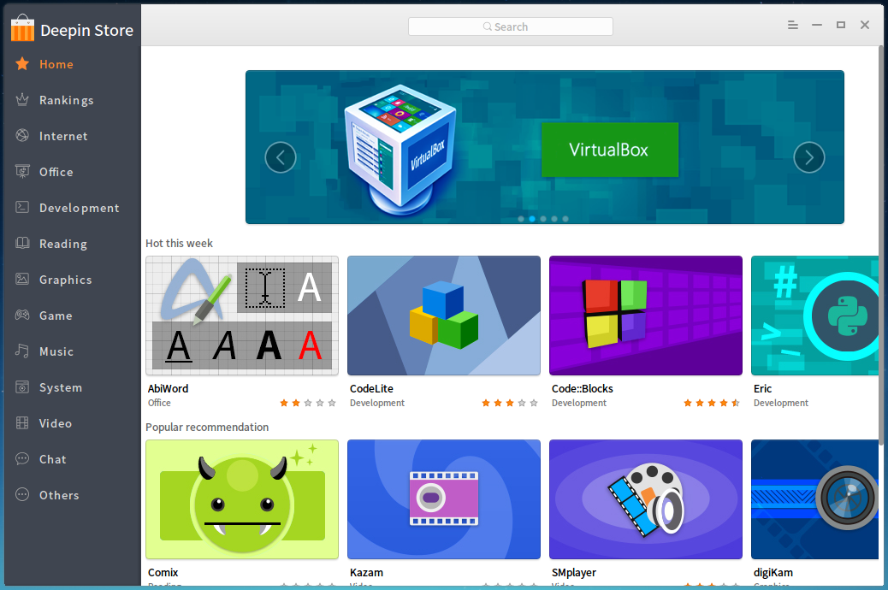 

<table class="block1">
    <caption>Main Interface</caption>
    <tbody>
        <tr>
            <td width="20px">1</td>
            <td width="100px">Navigation Bar</td>
            <td>Navigation bar is mainly to display the home page, rankings and application categories of Deepin Store. </td>
        </tr>
        <tr>
            <td>2</td>
            <td>Search Box</td>
            <td>Users can quickly search applications in Deepin Store by search box. </td>
        </tr>
        <tr>
            <td>3</td>
            <td>Flashview</td>
            <td> Images of recommended applications will be circularly played in flashview. </td>
        </tr>
         <tr>
            <td>4</td>
            <td>Home Column</td>
            <td>Home column is mainly to display popular recommendation, weekly hot, monthly hot, hotapps and other applications. </td>
        </tr>
        <tr>
            <td>5</td>
            <td>Home Topic</td>
            <td>Home topic is mainly to display applications integrated from hot topic. </td>
        </tr>
        <tr>
            <td>6</td>
            <td>Task Management</td>
            <td>Task management is mainly to display the progress and speed of downloading application as well as the progress of installing applications. You also can suspend and delete the download tasks. </td>
        </tr>
        <tr>
            <td>7</td>
            <td>Menu Bar</td>
            <td> You can sign in, exit, view help and description of Deepin Store by menu bar. </td>
        </tr>
    </tbody>
 </table>

## Manager Applications|common/icon_manageinterface.svg|

You can search, download and install different categories of applications by Deepin Store. Meanwhile, more wonderful applications will be explored through popular recommendation, rankings, hotapps, hot topic, user comment and other ways.

### Search Applications

Search function is built in Deepin Store. Contents will be automatically completed after you input a keyword. Press  on keyboard to display all applications contained that keyword.

#### Automatch

1. On Deepin Store interface, click top search box.
2. Input a keyword.
3. The application name will be automatically matched and completed to display.

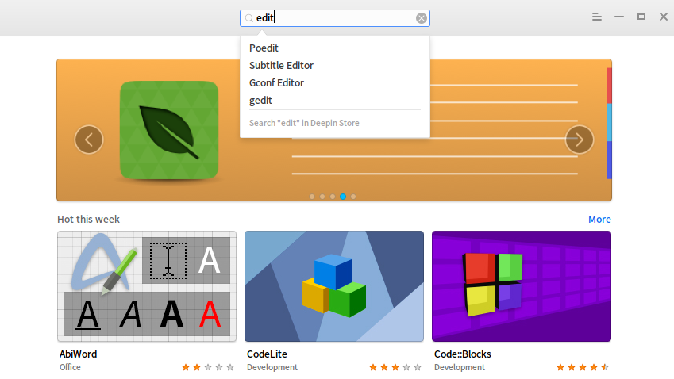

#### Universal Search

1. On Deepin Store interface, click top search box.
2. Input a keyword.
3. Press  on keyboard to automatically search and display all applications contained that keyword.

> : You also can directly search applications by clicking navigation bar, popular recommendation and other ways.

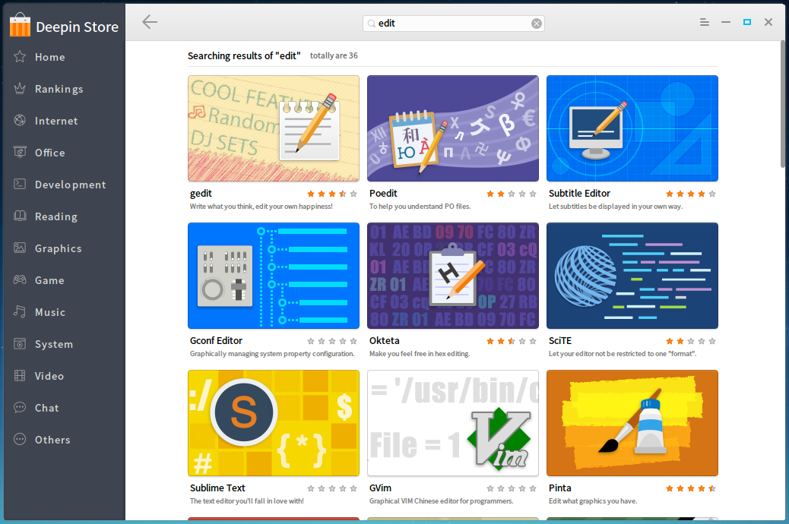

#### Clear Records

1. On Deepin Store interface, click top search box.
2. Click on .
3. Clear all records in the search box.

### Download/Install Applications

Deepin Store offers one-click download and installation of applications. During the downloading and installing process, you can view the current progress, speed and so on.

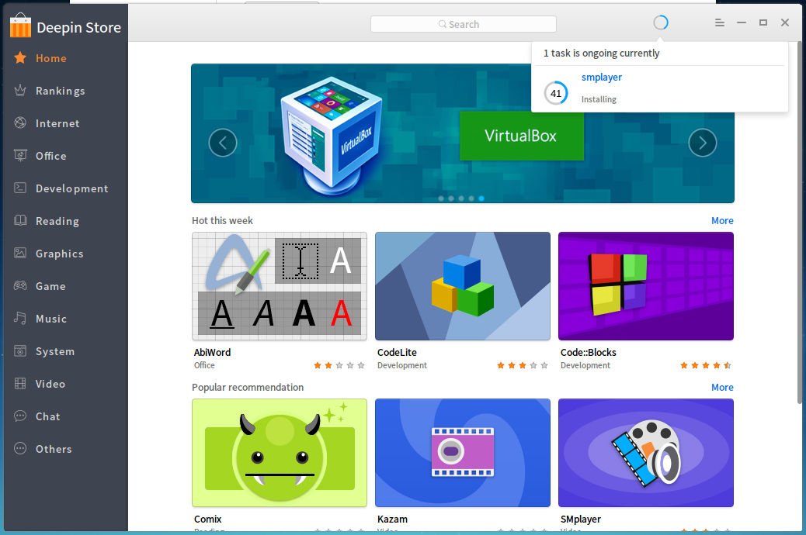

1. On Deepin Store interface, click the image of the application needed to download.
2. Enter the interface of detailed introduction.
3. Click on  to automatically download in task management.
4. You can view the download speed, progress and installing speed of the application.

> : You can directly hover mouse over the application icon, then click on .

### Update/Upgrade Application

If you need to update and upgrade the application, you can set in Control Center to update and upgrade, for specific operation please refer to [System Information](dman:///deepin-controlcenter#System Information).

### Uninstall Applications

If you need to uninstall applications, you can enter Launcher to uninstall, for specific operation please refer to [Uninstall Applications](dman:///deepin-system#Uninstall Applications).

## Application Interface|common/icon_appinterface.svg|

### Application Details

You can enter the interface of application details to know the introduction, size, version, downloads, ratings and so on.

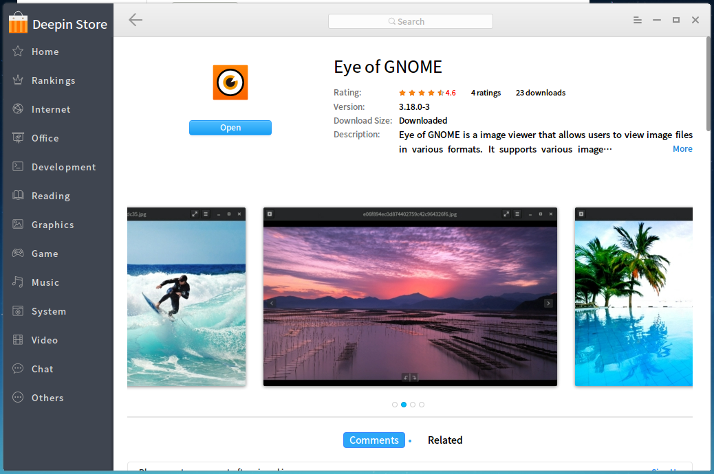

<table class="block1">
    <caption>Application Interface</caption>
    <tbody>
        <tr>
            <td width="20px">1</td>
            <td width="80px">Application Status</td>
            <td>You can view the status of applications. **Install** means the application has not been installed; **Open** means the application has been installed; **Update** means the application can be updated to the latest version. </td>
        </tr>
        <tr>
            <td>2</td>
            <td>Rating/Downloads</td>
            <td>You can view the comprehensive rating and downloads of applications. </td>
        </tr>
         <tr>
            <td>3</td>
            <td>Version of Applications</td>
            <td>You can view the version number of applications. </td>
        </tr>
        <tr>
            <td>4</td>
            <td>Size of Applications</td>
            <td>You can view the size of applications. </td>
        </tr>
        <tr>
            <td>5</td>
            <td>Description of Applications</td>
            <td>You can view the detailed description of applications. </td>
        </tr>
        <tr>
            <td>6</td>
            <td>Preview of Applications</td>
            <td>You can view the image preview of applications. </td>
        </tr>
    </tbody>
 </table>

### Comment and Rate

You can sign in Deepin Store to comment on and rate applications.  The comment and rating will be displayed successfully after both submitted at the same time.  If you do not sign in Deepin Store, you only can view commens and ratings

> : If you need to know the operation of signing up and signing in, please refer to [Sign In](#Sign In).

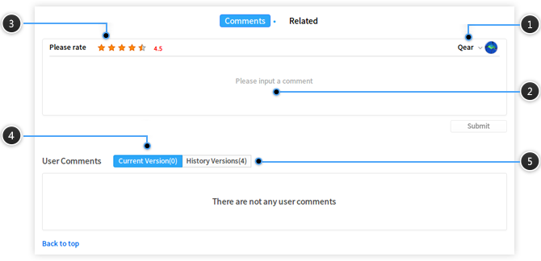

<table class="block1">
    <caption>Interface of Comments and Ratings</caption>
    <tbody>
        <tr>
            <td>1</td>
            <td>Sign In</td>
            <td>You can sign in Deepin Store with your account already signed up. </td>
        </tr>
        <tr>
            <td>2</td>
            <td>Comment</td>
            <td>You can input contents in the comment box after signed in. </td>
        </tr>
         <tr>
            <td>3</td>
            <td>Rating</td>
            <td>Hover the mouse over star icons to rate after signed in. </td>
        </tr>
        <tr>
            <td>4</td>
            <td>Current Version</td>
            <td>You can view comments and ratings of application's current version. </td>
        </tr>
        <tr>
            <td>5</td>
            <td>History Version</td>
            <td>You can view comments and ratings of application's history versions. </td>
        </tr>

    </tbody>
 </table>

## Option Settings|common/icon_optionsetting.svg|

### Sign In

You can sign in Deepin Store with your account already signed up.

1. On Deepin Store interface, click on .
2. Click on **Sign In**.
3. Input username and password.
4. If you want to enable auto-Sign-in, please drag the **Remember me** button rightwards.
5. Click on **Sign In**.

> : If you don't have an account, you can click on **Sign Up** of the pop-up box to sign up.

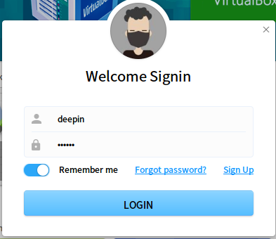

### Help

You can click "Help" to get the manual, which will help you further know and use Deepin Store.

1. On Deepin Store interface, click on .
2. Click on **Help**.
3. View the manual of Deepin Store.

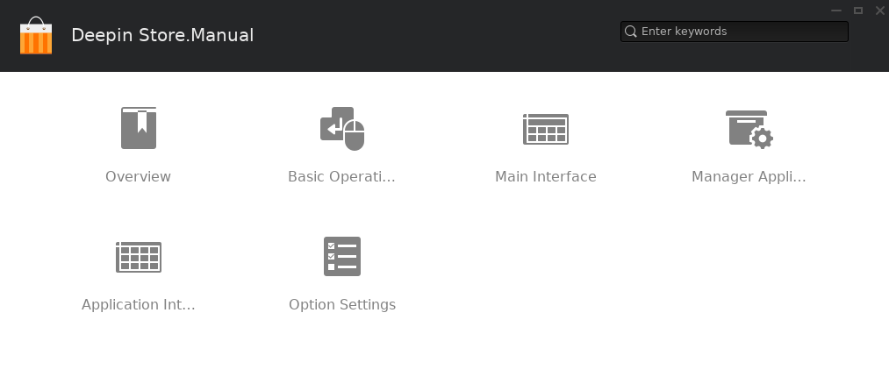

### About

You can click "About" to view the introduction of Deepin Store.

1. On Deepin Store interface, click on .
2. Click on **About**.
3. View the version and introduction of Deepin Store.

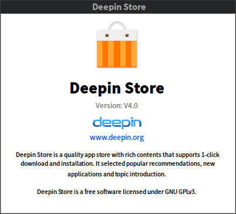

### Exit

You can click menu bar to exit Deepin Store.

1. On Deepin Store interface, click on .
2. Click on **Exit**.

