# 深度商店|../common/deepin-appstore.svg|

## 概述|../common/icon_overview.svg|
深度商店V4.0是武汉深之度科技有限公司重新打造的一款集应用展示、下载、安装、评论、评分于一体的应用程序。深度商店为您精心筛选和收录了不同类别的应用，同时每款应用都经过人工安装并验证，您可以进入商店搜索热门应用，一键下载并自动安装。

 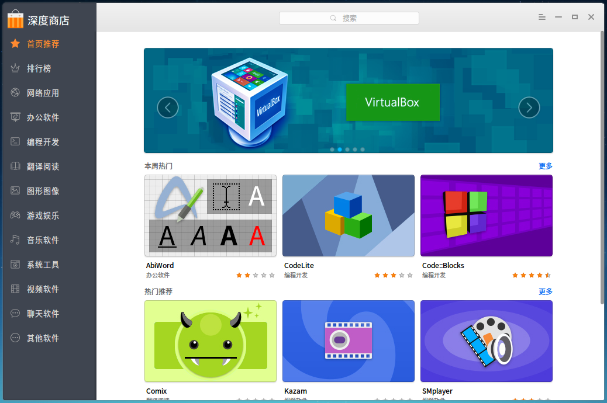

## 基本操作|../common/icon_basicoperation.svg|

### 运行深度商店
您可以通过执行以下操作来运行深度商店：

1. 点击任务栏上的  进入启动器界面。
2. 通过浏览找到  点击。

>   ：深度商店已经默认固定在任务栏上，您也可以点击任务栏上的  来运行。

### 最大/最小化深度商店

- 在深度商店界面，点击  最大化图标，深度商店将窗口最大化显示。如果要恢复正常显示，请点击  恢复原始窗口。
- 在深度商店界面，点击  最小化图标，深度商店将最小化到任务栏。如果要恢复显示，请点击任务栏上的  商店图标。

### 关闭深度商店

- 在深度商店界面，点击  关闭图标，退出深度商店。
- 右键单击任务栏上的  商店图标，选择 **关闭所有** 来退出深度商店。
- 在深度商店界面，点击菜单栏中 [退出](#退出)。

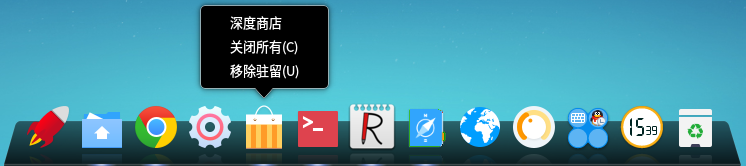

## 主界面|../common/icon_maininterface.svg|
深度商店主界面由导航栏、搜索框、首页轮播、首页栏目、专题应用、任务管理、菜单栏组成。

> ：向右或向左拖动导航栏边线，可以切换成图标或图标和名称显示。仅图标显示时，悬停在图标上就可以显示应用分类名称。

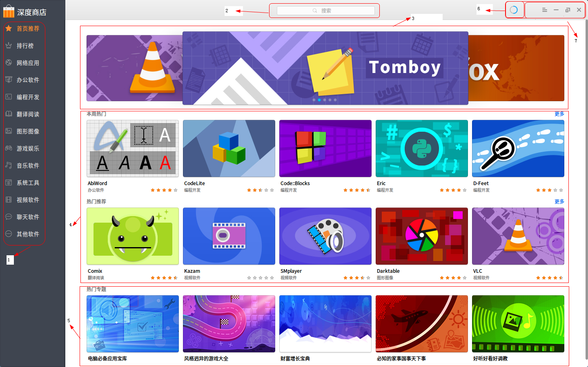

<table class="block1">
    <caption>主界面</caption>
    <tbody>
        <tr>
            <td width="20px">1</td>
            <td width="100px">导航栏</td>
            <td>导航栏主要显示深度商店的首页、排行榜以及应用分类。</td>
        </tr>
        <tr>
            <td>2</td>
            <td>搜索框</td>
            <td>用户可以通过搜素框快速查找深度商店中的所有应用。</td>
        </tr>
        <tr>
            <td>3</td>
            <td>首页轮播区域</td>
            <td>首页轮播区域主要循环播放推荐应用的图片。</td>
        </tr>
         <tr>
            <td>4</td>
            <td>首页栏目区域</td>
            <td>首页栏目区域主要展示热门推荐、本周热门、本月热门、装机必备等应用。</td>
        </tr>
        <tr>
            <td>5</td>
            <td>首页专题区域</td>
            <td>首页专题区域主要展示热门专题的应用合集。</td>
        </tr>
        <tr>
            <td>6</td>
            <td>任务管理</td>
            <td>任务管理主要显示当前下载应用的进度、速度以及安装应用的进度，您还可以暂停和删除下载任务。</td>
        </tr>
        <tr>
            <td>7</td>
            <td>菜单栏</td>
            <td>通过菜单栏您可以登录深度商店、查看帮助手册、关于深度商店、退出深度商店。</td>
        </tr>
    </tbody>
 </table>

## 管理应用|../common/icon_manageinterface.svg|
您可以通过深度商店搜索、下载、安装不同分类的应用，同时还可以根据热门推荐、下载排行、装机必备、热门专题、星级排行、用户评论等不同方式挖掘更多精彩应用。

### 搜索应用
深度商店中自带搜索功能，您只需在搜索框中输出关键字，将自动匹配补全内容。按下键盘上的  键，即可显示包含该关键字的所有应用。

#### 自动匹配

1. 在深度商店界面，点击顶部搜索框。
2. 输入关键字。
3. 在搜索框中将自动匹配补全并显示应用名称。

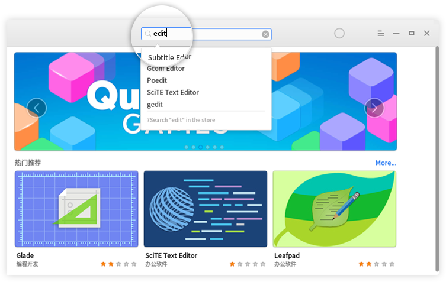

#### 全局搜索

1. 在深度商店界面，点击顶部搜索框。
2. 输入关键字。
3. 按下键盘上的  键，将自动搜索并显示包含该关键字的所有应用。

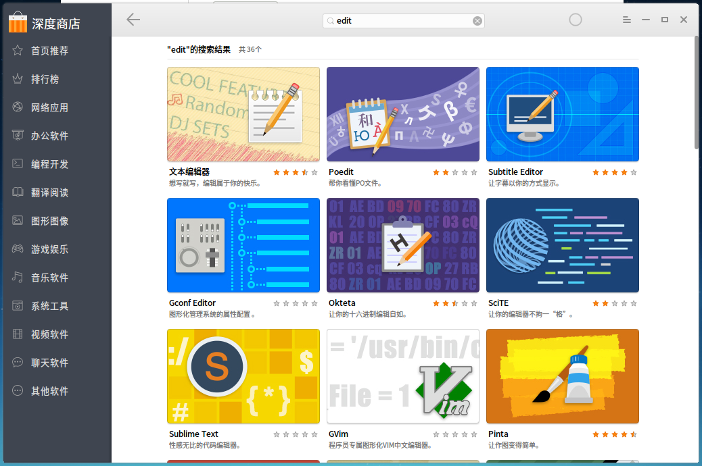

#### 清空记录

1. 在深度商店界面，点击顶部搜索框。
2. 点击  。
3. 清空搜索框内所有记录。

### 下载/安装应用
深度商店提供一键式的应用下载和安装，无需手动处理，同时在下载安装应用的过程中，您可以暂停、删除等操作，还可以查看当前应用的下载或安装进度、速度。

1. 在深度商店界面，点击需要下载应用的图片。
2. 进入该应用的详情界面。
3. 点击 ，将自动进入任务管理中下载并安装。
4. 您可以查看该应用的下载速度、下载进度或安装进度。

> ：您还可以直接将鼠标悬停在应用的图片上，点击 。

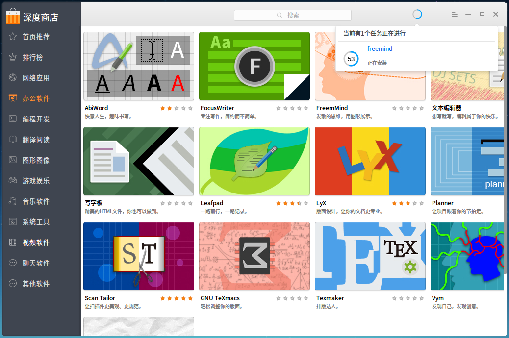

### 更新/升级应用

如果您需要更新和升级应用，可以通过控制中心来设置更新和升级应用，具体操作请参阅 [更新和升级](dman:///dde-control-center#更新和升级)。

> ：除了更新和升级应用，如果系统版本存在更新，您还可以通过控制中心更新和升级系统。

### 卸载应用

如果您需要卸载应用，可以通过进入启动器界面来卸载应用，具体操作请参阅 [卸载应用程序](dman:///dde#卸载应用程序)。

## 应用界面|../common/icon_appinterface.svg|

### 应用详情
您可以通过进入应用详情界面，了解应用的介绍、大小、版本、下载量、评分等信息。

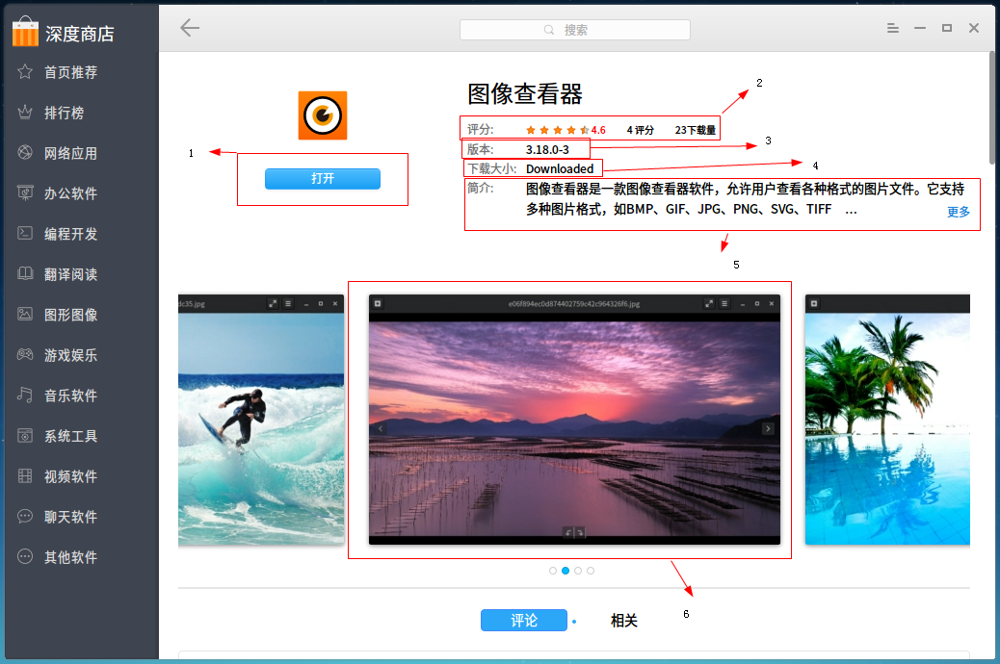

<table class="block1">
    <caption>应用界面</caption>
    <tbody>
        <tr>
            <td width="20px">1</td>
            <td width="80px">应用状态</td>
            <td>您可以查看应用的状态，显示 **安装** 表示该应用未安装；显示 **打开** 表示该应用已安装；显示 **更新** 表示该应用可更新至最新版本。</td>
        </tr>
        <tr>
            <td>2</td>
            <td>评分/下载量</td>
            <td>您可以查看应用的综合评分以及下载量。</td>
        </tr>
         <tr>
            <td>3</td>
            <td>应用版本</td>
            <td>您可以查看应用的版本号。</td>
        </tr>
        <tr>
            <td>4</td>
            <td>下载大小</td>
            <td>您可以查看应用的下载大小。</td>
        </tr>
        <tr>
            <td>5</td>
            <td>应用介绍</td>
            <td>您可以查看应用的详细介绍。</td>
        </tr>
        <tr>
            <td>6</td>
            <td>应用预览</td>
            <td>您可以查看应用的图片预览。</td>
        </tr>
    </tbody>
 </table>

### 评论和评分
您可以登录到深度商店中对应用进行评论或评分，但评论和评分必须同时提交才能成功，而且当前版本应用的评论和评分只能评论一次，如果您未登录则只能查看评论和评分。

> ：如果您需要了解注册和登录的信息，具体操作请参阅 [登录](#登录)。

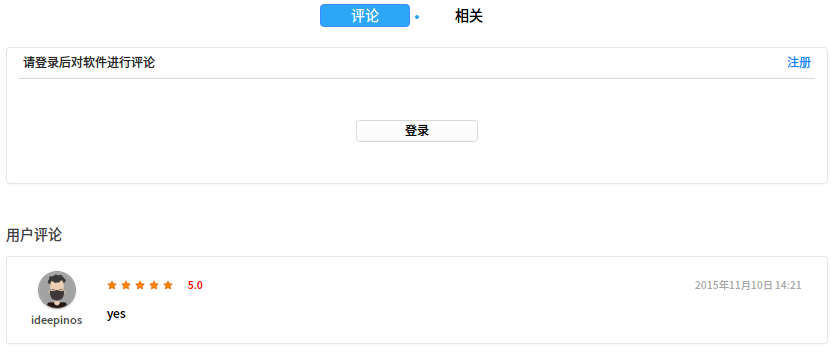

<table class="block1">
    <caption>评论和评分界面</caption>
    <tbody>
        <tr>
            <td>1</td>
            <td>登录</td>
            <td>您可以使用已注册帐号登录深度商店。</td>
        </tr>
        <tr>
            <td>2</td>
            <td>评论</td>
            <td>当您登录成功后，可以在评论框中输入内容。</td>
        </tr>
         <tr>
            <td>3</td>
            <td>评分</td>
            <td>当您登录成功后，将鼠标置于星型图标上点击进行评分。</td>
        </tr>
        <tr>
            <td>4</td>
            <td>当前版本</td>
            <td>您可以查看应用当前版本的评论和评分。</td>
        </tr>
        <tr>
            <td>5</td>
            <td>历史版本</td>
            <td>您可以查看应用历史版本的评论和评分。</td>
        </tr>

    </tbody>
 </table>

## 选项设置|../common/icon_optionsetting.svg|

### 登录
您可以使用深度科技论坛已注册的帐号直接登录深度商店。

1. 在深度商店界面，点击 。
2. 点击 **登录**。
3. 输入用户名和密码。
4. 如果需要开启自动登录功能，请点击 **记住密码** 开关按钮。
5. 点击 **登录**。

> ：如果您未注册帐号，通过点击弹出框中的 **注册** 按钮跳转到页面中进行注册。

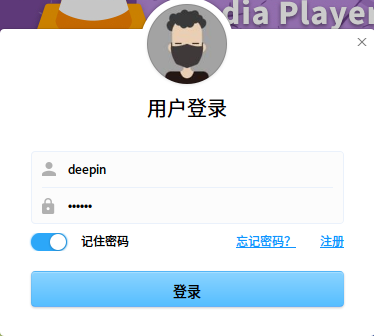

### 帮助
您可以点击帮助获取深度商店的帮助手册，通过帮助进一步让您了解和使用深度商店。

1. 在深度商店界面，点击 。
2. 点击 **帮助**。
3. 查看关于深度商店的帮助手册。

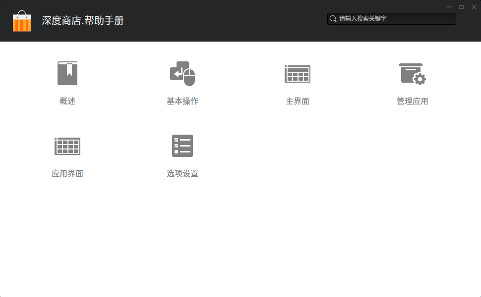

### 关于
您可以点击关于查看深度商店的版本介绍。

1. 在深度商店界面，点击 。
2. 点击 **关于**。
3. 查看关于深度商店的版本和介绍。

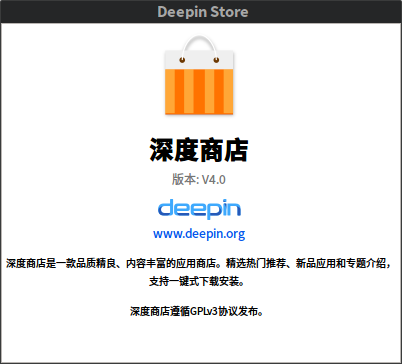

### 退出
您可以进入菜单栏点击退出深度商店。

1. 在深度商店界面，点击 。
2. 点击 **退出**。
