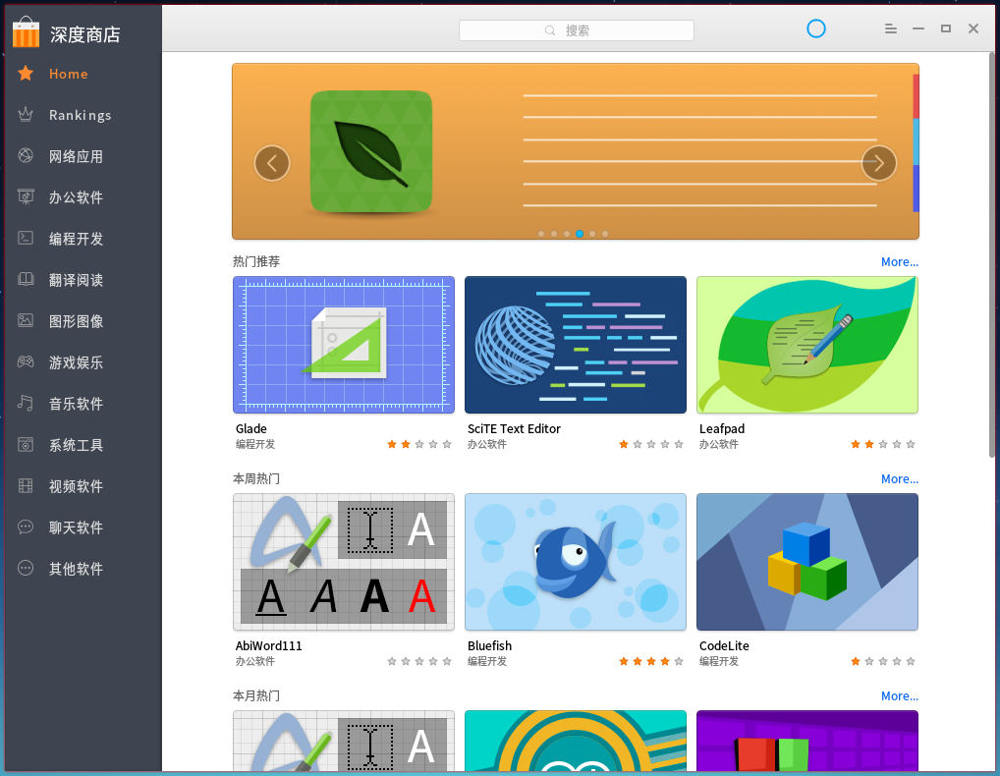
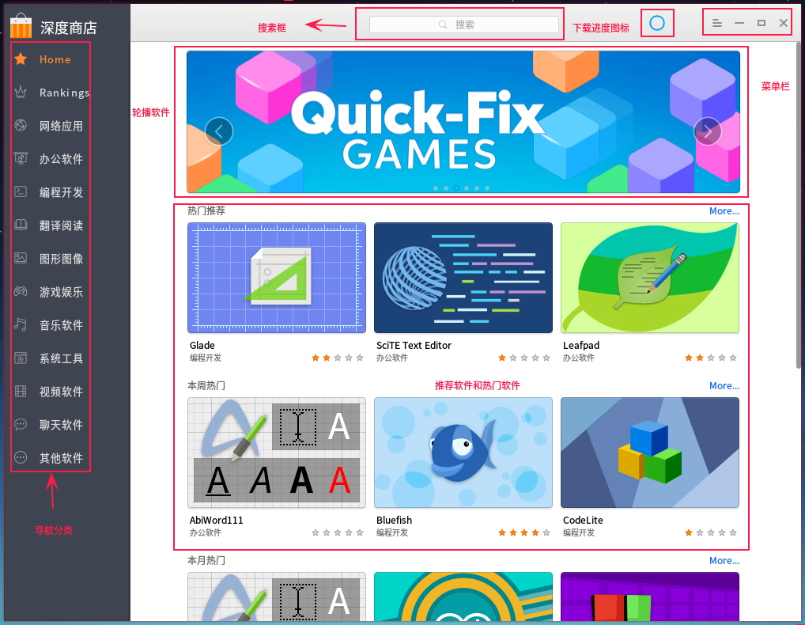
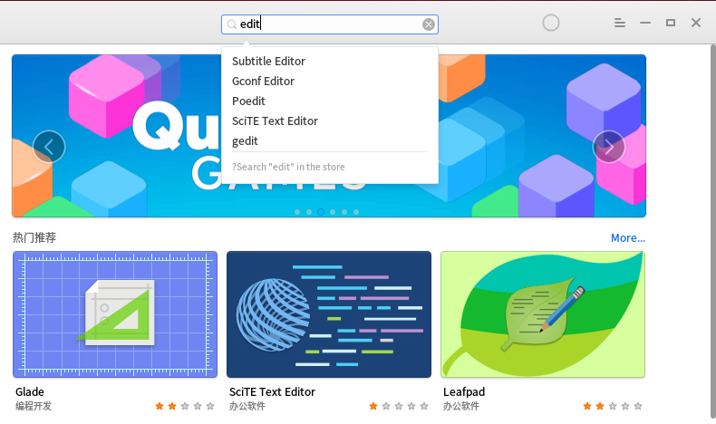
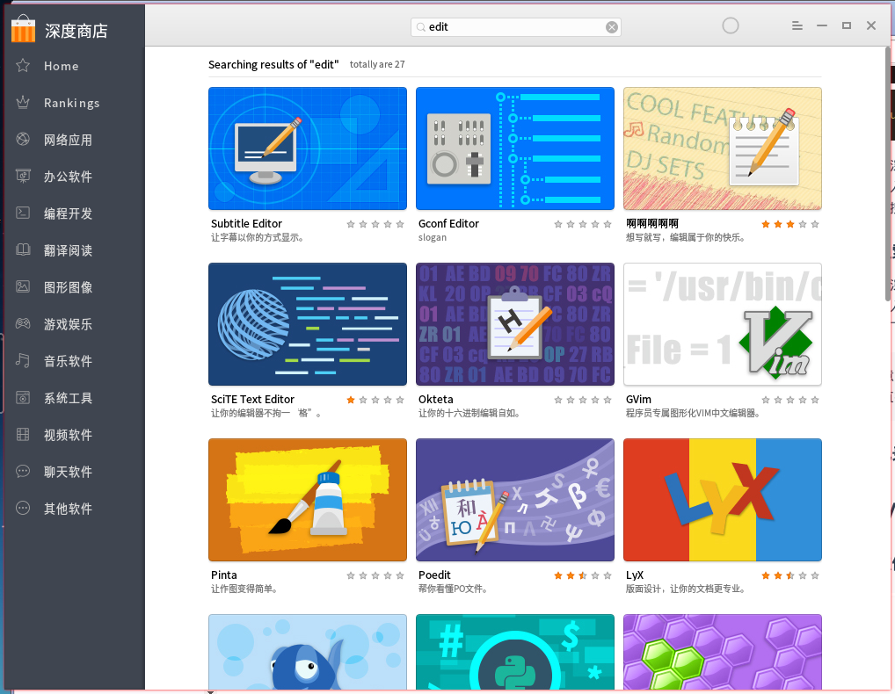
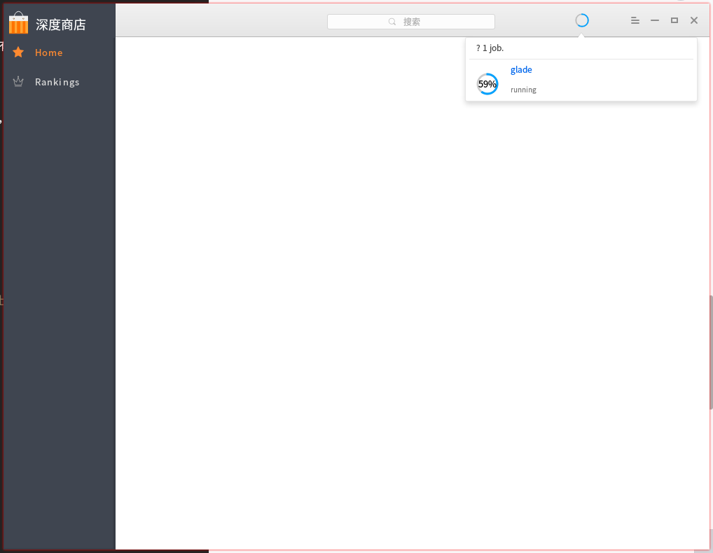
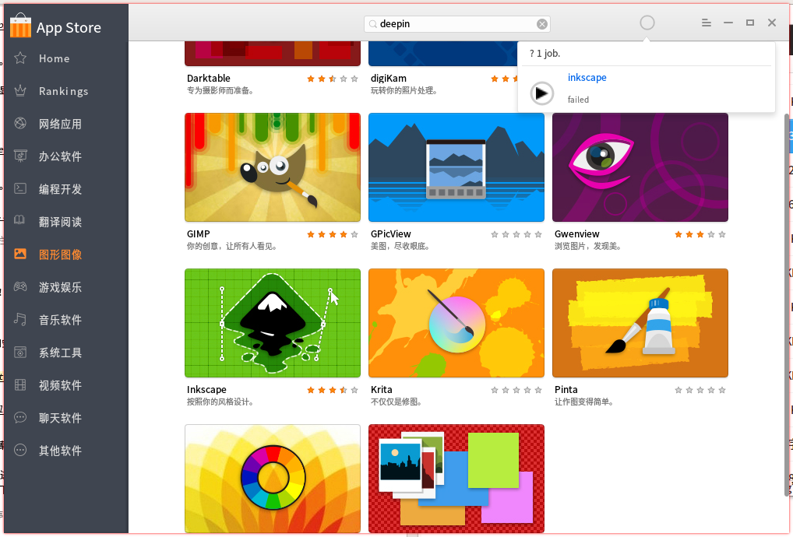
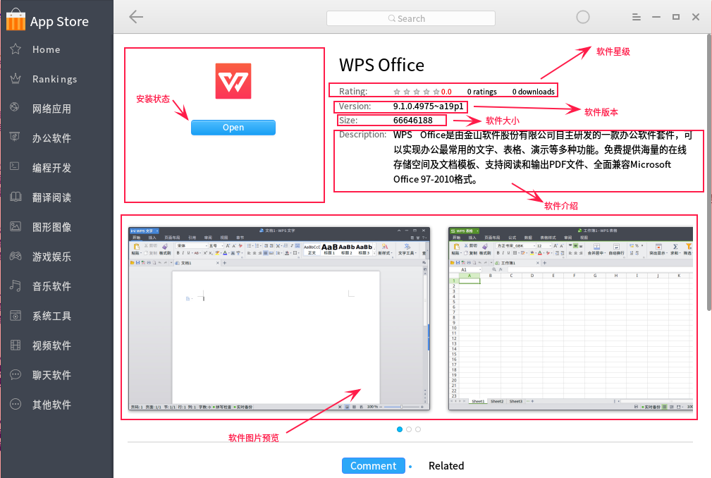
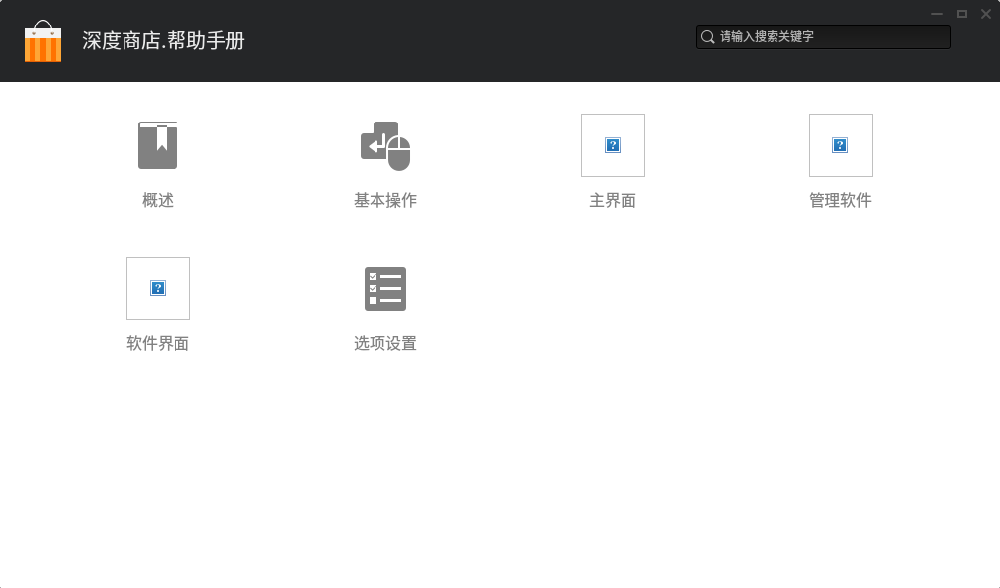
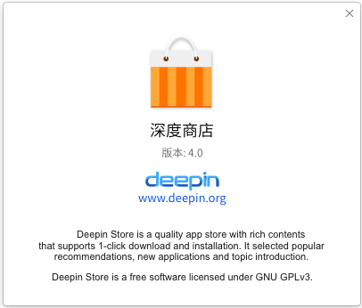

# 深度商店 |store-24.svg|

## 概述 |overview.svg|
深度商店V4.0是武汉深之度科技有限公司重新打造的一款应用程序，它提供的一个集应用下载、安装、评论、评分于一体的工具。

深度商店为您精心筛选不同类别的应用，同时收录的每款应用都经过人工安装并验证，您可以进入商店搜索热门应用，一键下载并自动安装。

 

## 基本操作 |basic-operation.svg|

### 运行深度商店

您可以通过执行以下操作来运行深度商店：

- 如果您已经将深度商店固定到桌面，在桌面，双击 。
- 如果您已经将深度商店固定到任务栏，点击任务栏上的  。
- 点击任务栏上的  进入启动器界面，通过浏览找到  点击。

### 最大/最小化深度商店

- 在深度商店界面，点击  最大化图标，深度商店窗口最大化显示。如果要恢复正常显示，请点击  恢复原始窗口。
- 在深度商店界面，点击  最小化图标，深度商店将最小化到任务栏。如果要恢复显示，请点击任务栏上的  商店图标。

### 关闭深度商店

在深度商店界面，点击  关闭图标，退出深度商店的运行。

> **注意**：您可以右键单击任务栏上的  商店图标，选择 **关闭所有** 来退出深度商店的运行，同时也可以参考从菜单栏中 [退出](#退出) 。

## 主界面 |basic-operation.svg|

深度商店主界面由导航栏、搜索框、首页轮播、首页栏目、任务管理、菜单栏组成。

 

<table class="block1">
    <caption>主界面介绍</caption>
    <tbody>
        <tr>
            <td>1</td>
            <td>导航栏</td>
            <td>导航栏主要显示深度商店的首页、排行以及分类。</td>
        </tr>
        <tr>
            <td>2</td>
            <td>搜索框</td>
            <td>搜索框主要提供用户搜索深度商店中的所有应用。</td>
        </tr>
        <tr>
            <td>3</td>
            <td>首页轮播区域</td>
            <td>首页轮播区域主要循环播放推荐应用的图片。</td>
        </tr>
         <tr>
            <td>4</td>
            <td>首页栏目区域</td>
            <td>首页栏目区域主要展示热门推荐、本周热门、本月热门、装机必备等应用合集。</td>
        </tr>
        <tr>
            <td>5</td>
            <td>首页专题区域</td>
            <td>首页专题区域主要展示热门专题的应用合集。</td>
        </tr>
        <tr>
            <td>6</td>
            <td>任务管理</td>
            <td>任务管理主要显示当前下载应用的进度、速度以及安装应用的进度，您还可以暂停和删除下载任务。</td>
        </tr>
        <tr>
            <td>7</td>
            <td>菜单栏</td>
            <td>通过菜单栏您可以登录深度商店、查看帮助、关于深度商店、退出深度商店。</td>
        </tr>
    </tbody>
 </table>

> **注意**：您可以将鼠标置于导航栏边线上向左拖动，此时导航栏仅以图标显示，悬停在图标上就可以显示分类名称。

## 管理应用 |basic-operation.svg|

您可以通过深度商店搜索、下载、安装不同分类的应用，同时还可以根据热门推荐、下载排行、装机必备、星级、用户评论等不同方式挖掘更多精彩应用。

### 搜索应用

深度商店中自带搜索功能，您只需在搜索框中输出关键字，讲自动匹配补全内容，按下  键即可显示包含该关键字的所有应用。

#### 自动匹配

1. 在深度商店界面，点击顶部搜索框。
2. 输入关键字。
3. 在搜索框中将自动匹配补全并显示应用名称。

#### 全局搜索

1. 在深度商店界面，点击顶部搜索框。
2. 输入关键字。
3. 按下键盘  键，将自动搜索并显示包含该关键字的所有应用。

> **注意**：您还可以通过导航栏分类、热门推荐等方式直接来查找应用。

#### 清空记录

在深度商店界面的搜索框中，点击  清空搜索框内所有记录。

### 下载/安装应用

深度商店提供一键式的下载和安装应用，无需手动处理，同时在应用下载安装过程中，您可以要查看当前应用的进度、速度等。

 

1. 在深度商店界面，点击需要下载的应用图片。
2. 进入该应用的详情界面。
3. 点击 ，该应用将自动进入任务管理中。
4. 您可以看到当前的下载速度、下载进度或安装进度。

> **注意**：您还可以直接将鼠标悬停在应用图片上，点击 。

### 更新/卸载应用

深度商店专注收录、展示、下载和安装应用，您可以通过控制中心来更新和升级应用，通过启动器界面来卸载应用，
具体操作请参考 [卸载应用程序](dman:///system#卸载应用程序)和[系统信息](dman:///controlcenter#系统信息)。

## 应用界面 |basic-operation.svg|

### 应用详情

您可以通过进入应用详情界面，了解应用的介绍、大小、版本、下载量、星级等信息。

<table class="block1">
    <caption>应用界面介绍</caption>
    <tbody>
        <tr>
            <td width="20px">1</td>
            <td width="80px">安装状态</td>
            <td>您可以查看当前应用的状态是否已安装，显示 **打开** 表示该应用已安装；显示 **安装** 表示该应用未安装。</td>
        </tr>
        <tr>
            <td>2</td>
            <td>星级/下载量</td>
            <td>您可以查看当前应用的综合星级以及下载量。</td>
        </tr>
         <tr>
            <td>3</td>
            <td>应用版本</td>
            <td>您可以查看当前应用的版本号。</td>
        </tr>
        <tr>
            <td>4</td>
            <td>应用大小</td>
            <td>您可以查看当前应用的大小。</td>
        </tr>
        <tr>
            <td>5</td>
            <td>应用介绍</td>
            <td>您可以查看当前应用的详细介绍。</td>
        </tr>
        <tr>
            <td>6</td>
            <td>应用预览</td>
            <td>您可以查看当前应用的图片预览。</td>
        </tr>
    </tbody>
 </table>

### 评论和评分

您可以登录到深度商店中对应用进行评论或评分，评论和评分必须同时提交才能成功。如果您未登录则只能查看评论和评分。

> **注意**：如果您需要了解注册和登录的操作，请参考 [登录](#登录)。

<table class="block1">
    <caption>应用界面介绍</caption>
    <tbody>
        <tr>
            <td>1</td>
            <td>注册</td>
            <td>您可以点击注册跳转到深度科技官网进行注册。</td>
        </tr>
        <tr>
            <td>2</td>
            <td>登录</td>
            <td>您可以使用已注册账号和密码登录深度商店。</td>
        </tr>
        <tr>
            <td>3</td>
            <td>评论</td>
            <td>当您登录成功后，可以在评论框中输入内容并提交评论。</td>
        </tr>
         <tr>
            <td>4</td>
            <td>评分</td>
            <td>当您登录成功后，将鼠标置于星型图标上点击进行评分。</td>
        </tr>
        <tr>
            <td>5</td>
            <td>当前版本</td>
            <td>您可以查看应用当前版本的评论和评分。</td>
        </tr>
        <tr>
            <td>6</td>
            <td>历史版本</td>
            <td>您可以查看应用历史版本的评论和评分。</td>
        </tr>

    </tbody>
 </table>

## 选项设置 |option-setting.svg|

### 登录

您可以使用已注册的帐号直接登录深度商店。

1. 在深度商店界面，点击 。
2. 点击 **登录**。
3. 输入用户名和密码。
4. 如果要开启自动登录功能，请将 **记住密码** 按钮向右滑动。
5. 点击 **登录**。

> **注意**：如果您未注册账号，可通过点击弹出框中的 **注册** 按钮跳转到页面中进行注册。

### 帮助

您可以点击帮助获取深度商店的帮助手册，通过帮助进一步让您了解和使用深度商店。

1. 在深度商店界面，点击 。
2. 点击 **帮助**。
3. 查看关于深度商店的帮助文档。

### 关于

您可以点击关于查看深度商店的版本、介绍、许可等。

1. 在深度商店界面，点击 。
2. 点击 **关于**。
3. 查看关于深度商店的版本和介绍。

### 退出

您可以进入菜单栏点击退出深度商店。

1. 在深度商店界面，点击 。
2. 点击 **退出**。
3. 退出深度商店。

